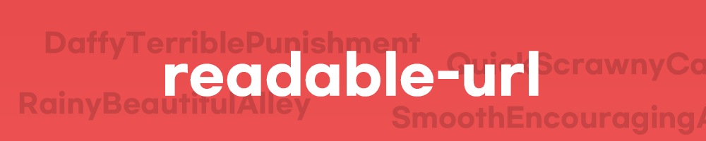

<!-- ALL-CONTRIBUTORS-BADGE:START - Do not remove or modify this section -->
[](#contributors-)
<!-- ALL-CONTRIBUTORS-BADGE:END -->
Generate readable random phrases for URLs


-----

## How To Use
This library is available on packagist.
To install, 
```shell script
composer require hyungju/readable-url
``` 

Then create ``ReadableURL`` Class
```php
$readableURL = new HyungJu\ReadableURL();
```

You can pass four parameters to the class.
```php
use HyungJu\ReadableURL;
// Takes 4 parameters.
// 1. A boolean value - If true, returns string in CamelCase, else lowercase.
// 2. An integer value - The number of words to be generated in the string. (Between 2 and 10).
// 3. A string - The seperator between the words.
// 4. Language Class - Currently Supported : HyungJu\Language\En, HyungJu\Language\Ko. pass language instance! the default is HyungJu\Language\En
$readableURL = new ReadableURL();
//$readableURL = new HyungJu\ReadableURL(false, 5, '-', new HyungJu\Language\Ko()); // Other options.
```

To generate `ReadableURL`, call the `generate()` function.
```php
use HyungJu\ReadableURL;

...

$readableURL = new ReadableURL();
$readableURL->generate();
// > QuickScrawnyCamp
```

In addition, the following are simple to:
```php
use HyungJu\ReadableURL;

...

$str = ReadableURL::gen();
// > FierceSaltyComparison
```

This can be used to add to the end of a URL.

Example: `https://example.com/photos/ForgetfulHarshEgg`

For best results, use an integer value of 3, 4, or 5.

## Test
`composer test` 

## Adding new language
1. Add wordsets to `src/words/[language code]`.
adjectives.txt and nouns.txt are needed. 

2. Create your language class `src/Language/[language code].php`. the class name must be started with Uppercase.

3. Implement the class based on other languages already implemented (korean and english)

4. Register your language in `src/Language/LanguageHelper.php`.

5. (optional) Add test for your language.

## Versioning
We use [SemVer](https://semver.org/) for versioning this project.

## License
MIT License

* This library is a PHP port of [readable-url](https://www.npmjs.com/package/readable-url)

## Contributors ✨

Thanks goes to these wonderful people ([emoji key](https://allcontributors.org/docs/en/emoji-key)):

<!-- ALL-CONTRIBUTORS-LIST:START - Do not remove or modify this section -->
<!-- prettier-ignore-start -->
<!-- markdownlint-disable -->
<table>
  <tr>
    <td align="center"><a href="https://github.com/ddarkr"><br /><sub><b>도다</b></sub></a><br /><a href="https://github.com/HyungJu/readable-url/commits?author=ddarkr" title="Code">💻</a></td>
    <td align="center"><a href="https://github.com/JulianOtten"><br /><sub><b>Yukihyõ</b></sub></a><br /><a href="https://github.com/HyungJu/readable-url/commits?author=JulianOtten" title="Code">💻</a></td>
  </tr>
</table>

<!-- markdownlint-restore -->
<!-- prettier-ignore-end -->

<!-- ALL-CONTRIBUTORS-LIST:END -->

This project follows the [all-contributors](https://github.com/all-contributors/all-contributors) specification. Contributions of any kind welcome!